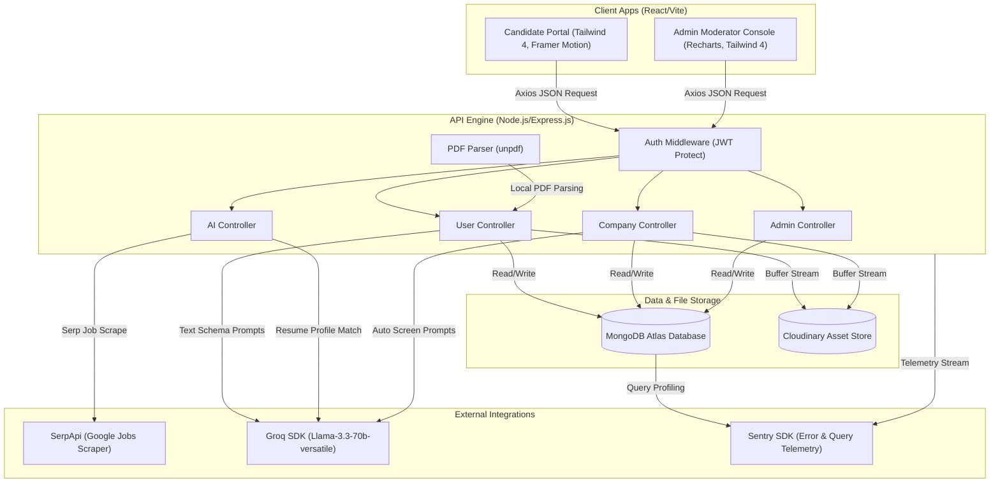
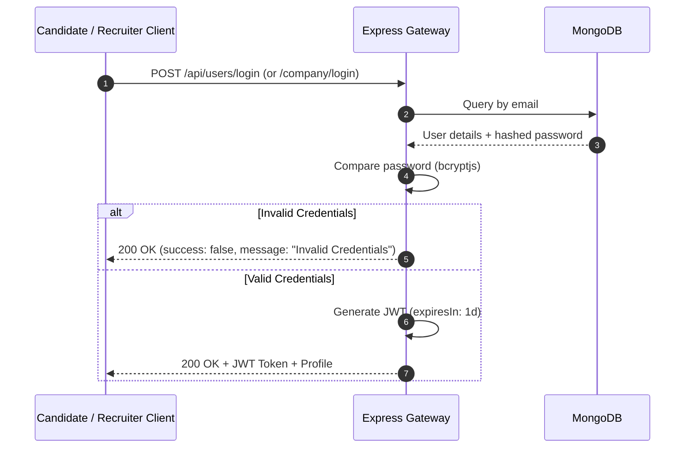
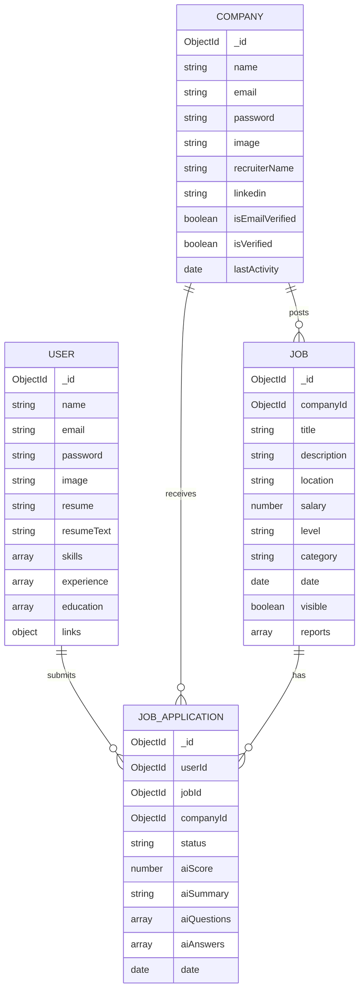

<div align="center">
  <!-- HERO BANNER PLACEHOLDER -->


  <br />
  <br />

  <!-- LOGO PLACEHOLDER -->


  <h1 align="center">InsiderJobs</h1>
  <p align="center"><strong>Enterprise AI-Powered Career Command Center & Applicant Tracking System (ATS)</strong></p>

  <p align="center">
    A high-performance recruitment ecosystem bridging top talent with leading companies. Built using React, Node.js/Express.js, MongoDB Atlas, and Groq Cloud LLaMA 3.3. Enabling real-time candidate pre-screening, automated PDF resume parsing, interactive ATS compatibility audits, SerpApi job discovery, and an administrative moderation panel.
  </p>

  <!-- METRIC BADGES -->
  <p align="center">
    <a href="https://react.dev/"></a>
    <a href="https://nodejs.org/"></a>
    <a href="https://www.mongodb.com/"></a>
    <a href="https://tailwindcss.com/"></a>
    <a href="https://groq.com/"></a>
  </p>

  <p align="center">
    
    
    
    
    
    <a href="https://sentry.io/"></a>
  </p>
  
  <p align="center">
    <a href="#-installation--local-development"></a>
    <a href="https://www.linkedin.com/in/sarthak-dudhe-570a2a22b/"></a>
    <a href="https://github.com/SarthakDudhe"></a>
  </p>
</div>

---

## 📖 Table of Contents
- [⚡ Key Achievements & Engineering Highlights](#-key-achievements--engineering-highlights)
- [🧩 Architecture & System Design](#-architecture--system-design)
- [🧠 AI Capabilities & Advanced Pipeline](#-ai-capabilities--advanced-pipeline)
- [🚀 Interactive Feature Showcase](#-interactive-feature-showcase)
- [🛠️ Technical Excellence & Performance Optimizations](#%EF%B8%8F-technical-excellence--performance-optimizations)
- [💻 Installation & Local Development](#-installation--local-development)
- [📡 API Documentation](#-api-documentation)
- [📦 Database Schema Overview](#-database-schema-overview)
- [📂 Folder Structure](#-folder-structure)
- [🔒 Security Implementations](#-security-implementations)
- [🗺️ Product Roadmap](#%EF%B8%8F-product-roadmap)
- [🤝 Contributing & License](#-contributing--license)

---

## ⚡ Key Achievements & Engineering Highlights

For Technical Recruiters, Engineering Managers, and Hiring leads, here are the most noteworthy engineering achievements in the **InsiderJobs** repository:

> [!TIP]
> **Production-Grade Complexity:** This is a fully productionized job board and recruiter moderation platform that implements advanced LLM parsing pipelines, automated data backfills, telemetry error-monitoring, and strict security verification checks.

*   **Intelligent AI Orchestration (Groq LLaMA 3.3 70B):** Implemented a server-side parser using `unpdf` that extracts raw text buffers from uploaded PDF resumes. This data is fed into the Groq SDK (`llama-3.3-70b-versatile`) with structured JSON schema enforcement (`response_format: { type: "json_object" }`). The AI automatically extracts technical skills, past experience duration, education, and links to build structured developer profiles in real-time.
*   **Asynchronous IIFE Screening Pipeline:** When a candidate applies for a job, the server responds instantly with a success message, while an asynchronous, self-invoking IIFE block runs in the background. It analyzes the candidate's resume against the job description using Groq to score the applicant (0-100), generate a custom resume TL;DR summary, and produce 3 tailored interview questions with benchmark answers for recruiter evaluation.
*   **Zero-Loss Clerk-to-Mongoose Database Migration:** Handled seamless migration of Clerk-authenticated legacy candidate profiles to a native Mongoose authentication layer. When a legacy user registers with their email, the registration controller fetches Clerk metadata, hashes their new password via `bcryptjs`, copies existing documents (resumes, parsed data, links), deletes the Clerk database records safely, and updates past application records to reflect the new ObjectId in MongoDB.
*   **N+1 Query Resolution via MongoDB Aggregations:** Resolved potential database bottlenecks in the Recruiter Dashboard. Instead of running query loops to find applicant counts for each company job, the backend runs a single MongoDB aggregation query (`$match` -> `$group` by `$jobId` -> `$sum` applicant records), reducing query execution from $O(N)$ down to a single $O(1)$ lookup mapping.
*   **Mongoose Sentry Telemetry:** Configured Sentry Node SDK with `@sentry/node` and native mongoose integrations. This ensures that any slow Mongoose queries, database connection failures, or server crashes are immediately logged with full call stack trace telemetry to Sentry.

---

## 🧩 Architecture & System Design

### System Component Flow
The following flowchart illustrates the decoupled client-server interaction, showing how the frontend React portals communicate with the Express gateway, and how data flows to MongoDB Atlas, Cloudinary, and external APIs (Groq and SerpApi).



### Authentication Flow (Stateless JWT)
Security is enforced using stateless JSON Web Tokens. If a candidate, recruiter, or admin requests access, they go through the following sequence:



---

## 🧠 AI Capabilities & Advanced Pipeline

InsiderJobs uses the LLaMA 3.3 70B model hosted on Groq Cloud to deliver instantaneous resume analytics, job fit auditing, and pre-screening.

<div align="center">
  <!-- AI FLOWPLACEHOLDER -->
  
  <p><em>System Pipeline: Resume Upload -> PDF Text Extraction -> Groq LLaMA JSON Schema Structuring -> Vector ATS Auditing</em></p>
</div>

### 1. The Resume Parsing Pipeline
*   **Step A (Buffer Extraction):** Candidate uploads their PDF resume. Multer processes the file and passes the buffer.
*   **Step B (Text Generation):** `unpdf` reads the binary array buffer using the document proxy and extracts plain text.
*   **Step C (Semantic Structuring):** The backend compiles a strict schema prompt and contacts the Groq API.
*   **Step D (Profile Build):** LLaMA 3.3 returns a strictly typed JSON object containing arrays of skills, past experience role details, and education degrees. This is cached directly in the `User` document.

### 2. Manual ATS Resume Fit Auditor
Candidates can click **"Analyze Resume Fit"** on any job description page. The server extracts the job specifications, grabs the candidate's cached resume text, and generates:
1.  **ATS Match Score:** A precise mathematical compatibility index (0 - 100%).
2.  **Missing Key Skills:** Highlighted keywords found in the job posting but missing from the resume.
3.  **Tailoring Suggestions:** Actionable bullet points explaining how to rephrase the resume to rank higher.

### 3. Recruiter Screening Engine
Recruiters can screen any applicant's application. The system reviews the resume text, scores it, summarizes the fit in a 150-character badge (e.g. *Worked at Google. Lacks Kubernetes. 5y React experience.*), and generates exactly **3 custom interview questions** with corresponding **ideal benchmark answers** so recruiters know what response to look for.

---

## 🚀 Interactive Feature Showcase

### 👨‍💻 Candidate Workspace
*   **Resume Extraction & Profile Build:** Upload a PDF to automatically fill out tech skills, past experience, and educational background.
*   **Dynamic ATS Audit:** Real-time feedback on job postings with score indicators and missing keywords.
*   **AI Job Recommender:** Dynamically scrapes live jobs matching extracted resume skills in India using SerpApi Google Jobs.
*   **Funnel Analytics Dashboard:** 
    *   Dynamic Ring Charts rendering application status percentages (using pure CSS conic gradients).
    *    Funnel progress bars representing accepted/pending/rejected conversions.
    *   **Ghost Job Tracker:** Flags applications pending for 14+ days as "stale" to warn candidates.
    *   **Hiring Speed Metrics:** Computes the average decision time for each company based on historical database resolutions.

<div align="center">
  <!-- DYNAMIC DASHBOARD PLACEHOLDER -->
  
  <p><em>Candidate command center showing application statistics, CSS conic-gradient charts, and stale job warnings</em></p>
</div>

### 🏢 Recruiter Console
*   **Work Domain Email Restriction:** Recruiter registration blacklists public email domains (gmail, yahoo, outlook, etc.). Recruiter profiles require corporate domains to minimize spam postings.
*   **Double-Lock Verification Pipeline:** Job postings are locked until the recruiter verifies their email (verification token link logged on server) AND the Admin manual approval flag is set.
*   **Rich Job Creator:** Post jobs with Quill rich-text editor, defining salary range, location, Category, and experience level.
*   **AI Screening Cards:** Expandable candidate cards displaying fit score, resume TL;DR, and 3 custom interview questions. Ideal answers are hidden under visual toggle buttons.
*   **optimistic state updates:** Actions like changing application status or deleting listings trigger optimistic frontend updates paired with periodic 30-second background polling to prevent latency.

### 👑 Admin Moderator Panel
*   **7-Day Recharts Activity Chart:** Plots jobs posted vs. applications submitted over the last week.
*   **Workspace Approvals:** Approve or revoke company registrations to manage site-wide active permissions.
*   **Report Queue:** Flags jobs reported by candidates (e.g. Ghost Jobs, Fake Postings). Admins can dismiss flags or delete job postings instantly (cascading to clean up all applications).

---

## 🛠️ Technical Excellence & Performance Optimizations

### 1. N+1 Query Resolution
On the recruiter dashboard, rendering listed jobs alongside their respective applicant count could cause $N+1$ database queries. To optimize this, the system uses MongoDB aggregations to group and count in a single query:
```javascript
const applicantCounts = await JobApplication.aggregate([
    { $match: { companyId: new mongoose.Types.ObjectId(companyId) } },
    { $group: { _id: "$jobId", count: { $sum: 1 } } }
])
```

### 2. Disk Storage and Temp File Cleanup
Resumes are handled using `multer` with disk storage. To prevent disk space exhaustion, the file upload controller utilizes a `finally` block to guarantee temp files are unlinked even if Cloudinary uploads fail:
```javascript
try {
    const resumeUpload = await cloudinary.uploader.upload(resumeFile.path);
    // ... logic ...
} finally {
    if (req.file?.path) {
        fs.unlink(req.file.path, (err) => {
            if (err) console.error("Temp file cleanup error:", err.message);
        });
    }
}
```

### 3. Hiring Activity Speed Calculation
When fetching jobs, the backend dynamically calculates the hiring speed of the posting company, adding metadata tags to the jobs on the fly:
```javascript
const diffTime = Math.abs(new Date() - new Date(lastActivity));
const diffDays = diffTime / (1000 * 60 * 60 * 24);
if (diffDays <= 7) hiringActivity = 'active';
else if (diffDays <= 21) hiringActivity = 'slow';
else hiringActivity = 'stale';
```

---

## 💻 Installation & Local Development

Follow these steps to set up the entire workspace locally.

### Prerequisites
*   Node.js (v18.0.0 or higher)
*   MongoDB Atlas Cluster (or a local MongoDB instance)
*   Groq API Key (Access via [console.groq.com](https://console.groq.com/))
*   SerpApi Key (Access via [serpapi.com](https://serpapi.com/))
*   Cloudinary Account (Access via [cloudinary.com](https://cloudinary.com/))

### Project Repository Layout
```
InsiderJobs/
├── server/      # Node.js/Express.js REST API Backend
├── client/      # Candidate & Recruiter React/Vite App
└── admin/       # Administrator Moderation Panel React/Vite App
```

---

### Step 1: Backend Setup
1.  Navigate to the server directory:
    ```bash
    cd server
    ```
2.  Install all dependencies:
    ```bash
    npm install
    ```
3.  Create a `.env` file in the `server` directory and configure the environment variables:
    ```env
    PORT=5000
    MONGODB_URI="your_mongodb_atlas_connection_string"
    JWT_SECRET="your_custom_jwt_security_string"
    SERP_API_KEY="your_serp_api_token"
    GROK_API_KEY="your_groq_cloud_api_token"
    CLOUDINARY_NAME="your_cloudinary_cloud_name"
    CLOUDINARY_API_KEY="your_cloudinary_api_key"
    CLOUDINARY_SECRET_KEY="your_cloudinary_secret_key"
    ADMIN_EMAIL="admin@insiderjobs.com"
    ADMIN_PASSWORD="admin123_custom_password"
    ```
4.  Start the development server:
    ```bash
    npm run dev
    ```

---

### Step 2: Client Setup (Candidate & Recruiter Portal)
1.  Open a new terminal and navigate to the client directory:
    ```bash
    cd client
    ```
2.  Install dependencies:
    ```bash
    npm install
    ```
3.  Create a `.env` file in the `client` directory:
    ```env
    VITE_BACKEND_URL="http://localhost:5000"
    ```
4.  Launch the Vite developer server:
    ```bash
    npm run dev
    ```

---

### Step 3: Admin Dashboard Setup
1.  Open another terminal and navigate to the admin directory:
    ```bash
    cd admin
    ```
2.  Install dependencies:
    ```bash
    npm install
    ```
3.  Create a `.env` file in the `admin` directory:
    ```env
    VITE_BACKEND_URL="http://localhost:5000"
    ```
4.  Launch the Admin development server:
    ```bash
    npm run dev
    ```

---

## 📡 API Documentation

### Candidates / Users (`/api/users`)
| Method | Endpoint | Auth | Description |
|---|---|---|---|
| `POST` | `/register` | Public | Register new candidate (Clerk profiles are auto-migrated). |
| `POST` | `/login` | Public | Candidate email login. Returns JWT. |
| `GET` | `/profile` | Candidate JWT | Get candidate metadata (excludes password hashes). |
| `POST` | `/update-links` | Candidate JWT | Update profile social links (GitHub, LinkedIn, Portfolio). |
| `POST` | `/update-resume` | Candidate JWT | Upload PDF resume to Cloudinary, parse text, extract skills. |
| `POST` | `/apply` | Candidate JWT | Apply for a job and trigger the background pre-screening IIFE. |
| `GET` | `/applications` | Candidate JWT | Fetch all applied jobs history. |
| `POST` | `/ats-audit/:jobId` | Candidate JWT | Manually compare candidate resume with the specified job details. |
| `GET` | `/ai-recommender` | Candidate JWT | Fetch SerpApi jobs matching extracted resume keywords. |

### Recruiters / Companies (`/api/company`)
| Method | Endpoint | Auth | Description |
|---|---|---|---|
| `POST` | `/register` | Public | Register company. Blacklists public domain emails. |
| `POST` | `/login` | Public | Company email login. |
| `GET` | `/profile` | Recruiter JWT | Get logged-in company data. Updates `lastActivity` flag. |
| `POST` | `/post-job` | Recruiter JWT | Post a new job. Requires email verification & admin approval. |
| `GET` | `/applicants` | Recruiter JWT | Fetch all applications received for the company's jobs. |
| `GET` | `/posted-jobs` | Recruiter JWT | Fetch company job posts mapped to aggregate applicant counts. |
| `POST` | `/change-status` | Recruiter JWT | Accept or Reject a candidate application. |
| `POST` | `/change-visibility` | Recruiter JWT | Toggle job visibility state. |
| `GET` | `/verify-email` | Public | Verify company work email using query token. |
| `POST` | `/resend-verification`| Recruiter JWT | Regenerate email verification link. |
| `POST` | `/screen-application` | Recruiter JWT | Manually run AI Candidate Screening for detailed assessment. |

### Administrative Moderation (`/api/admin`)
| Method | Endpoint | Auth | Description |
|---|---|---|---|
| `POST` | `/login` | Public | Authenticate administrator credentials. |
| `GET` | `/stats` | Admin JWT | Fetch metrics counts (total jobs, companies, pending apps). |
| `GET` | `/companies` | Admin JWT | List all registered workspaces for moderation. |
| `POST` | `/verify` | Admin JWT | Approve or revoke company workspace domains manually. |
| `GET` | `/jobs` | Admin JWT | List all listed jobs for administrative deletion. |
| `GET` | `/reported-jobs` | Admin JWT | List jobs flagged by candidates. |
| `POST` | `/dismiss-report` | Admin JWT | Clear reports list for a flagged job listing. |
| `POST` | `/delete-job` | Admin JWT | Delete job posting and associated applications permanently. |
| `GET` | `/analytics` | Admin JWT | Get daily counts of jobs vs. applications for the past 7 days. |

---

## 📦 Database Schema Overview



---

## 📂 Folder Structure

```
InsiderJobs/
├── admin/                     # Admin moderation panel (Vite/React)
│   ├── src/
│   │   ├── assets/            # SVG icons and logos
│   │   ├── App.jsx            # Main Admin dashboard logic
│   │   ├── index.css          # Admin styling
│   │   └── main.jsx           # App entry point
│   ├── package.json
│   └── vite.config.js
├── client/                    # Candidate & Recruiter portal (Vite/React)
│   ├── src/
│   │   ├── assets/            # Static assets and icons
│   │   ├── components/        # React components (Navbar, JobCard, Login, etc.)
│   │   ├── context/           # AppContext state manager
│   │   ├── LoaderFront/       # Custom page loader
│   │   ├── Pages/             # Routing views (ApplyJob, Recommender, Dashboard)
│   │   ├── index.css          # Main stylesheet
│   │   └── main.jsx           # React app entry point
│   ├── package.json
│   └── vite.config.js
├── server/                    # Express backend engine
│   ├── config/                # DB connection, Cloudinary, Sentry instrumentation
│   ├── controllers/           # API request controllers (AI, admin, user, company)
│   ├── middlewares/           # JWT verification middlewares (User, Recruiter, Admin)
│   ├── models/                # MongoDB Mongoose schemas
│   ├── routes/                # Express routing files
│   ├── utils/                 # Token generator utilities
│   ├── server.js              # Entry point Express script
│   └── vercel.json            # Deployment routing mapping
└── README.md                  # Recruiter documentation
```

---

## 🔒 Security Implementations

*   **Corporate Domain Validation:** Recruiter sign-up checks domain suffixes and rejects public webmail providers (gmail, yahoo, hotmail, etc.) to verify legitimate company workspaces.
*   **Role-Based Access Control (RBAC):** Three distinct middleware guards (`protectUser`, `protectCompany`, `protectAdmin`) enforce JWT permissions depending on the route, isolating candidates from company applications and recruiters from administration logs.
*   **Stateless Token Expiry:** Tokens use standard signatures with brief valid lifespans (1 day) to reduce hijacking risks.
*   **Secure Password Encription:** Candidate and company registration hashes passwords using `bcryptjs` with 10 salt rounds before storing them in MongoDB.
*   **Sanitized Uploads & Cleanups:** PDF resumes are validated through Multer before streaming to Cloudinary. Local temporary files are deleted in `finally` blocks using `fs.unlink`.

---

## 🗺️ Product Roadmap

### Completed Milestones
*   [x] JWT Stateless authentication for Candidates, Companies, and Admins.
*   [x] Automated PDF resume parsing and caching on profile updates.
*   [x] Real-time ATS match scoring and tailoring suggestions.
*   [x] SerpApi integration to scrape relevant Google Job openings.
*   [x] Multi-tenant moderator console with Recharts metrics tracking.

### Future Enhancements
*   [ ] **Real-Time Notification Websockets:** Instantly notify candidates on job application acceptance/rejection via Socket.io.
*   [ ] **Vector Embeddings Search:** Replace SerpApi key-matching with native MongoDB Atlas vector search based on candidate resume embeddings.
*   [ ] **Integrated AI Interviewer:** Sandbox environment allowing candidates to take a mock interview based on the AI-generated questions.
*   [ ] **Multi-Currency CTC conversion:** Support multi-currency salaries using open exchange rate APIs.

---

## 🤝 Contributing & License

Contributions are welcome! Please follow these guidelines:
1.  Fork the repository.
2.  Create your feature branch: `git checkout -b feature/NewFeature`.
3.  Commit your changes: `git commit -m 'Add NewFeature'`.
4.  Push to the branch: `git push origin feature/NewFeature`.
5.  Open a Pull Request.

Distributed under the **ISC License**. See `LICENSE` in the repository for more information.

<div align="center">
  
  <p>Made with ❤️ by <a href="https://github.com/SarthakDudhe">Sarthak Dudhe</a></p>
</div>
