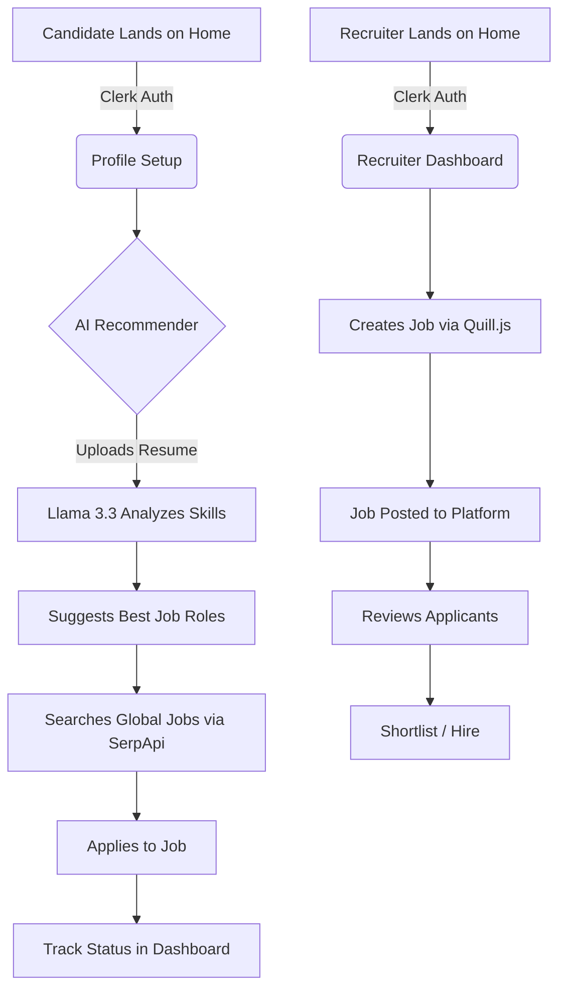
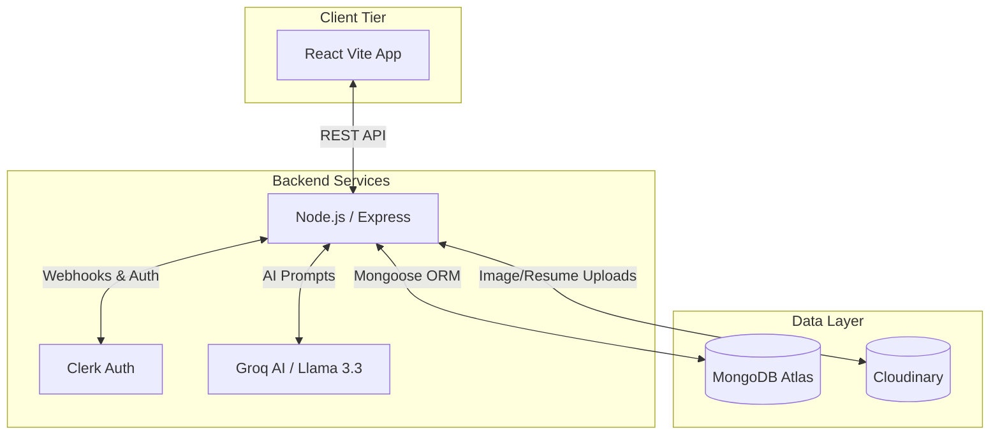

<div align="center">
  <!-- 
    PLACEHOLDER: Hero Banner Image
    Recommended Dimensions: 1200x400 pixels
    Content: A vibrant, visually striking banner showing the InsiderJobs dashboard, Glassmorphism UI elements, or an abstract representation of AI in recruitment.
  -->


  <br />
  <br />

  <!-- 
    PLACEHOLDER: Project Logo
    Recommended Dimensions: 200x200 pixels
    Content: The official InsiderJobs logo with a transparent background.
  -->


  **The Premium AI-Powered Career Ecosystem**

  

  *Bridging the gap between top-tier talent and forward-thinking recruiters through LLM-driven insights, premium aesthetics, and a highly scalable MERN architecture.*

  <p align="center">
    
    
    
    
    
  </p>

  <p align="center">
  
   
  </p>


</div>

---

## 🌟 Why This Project Matters

The modern recruitment landscape is fragmented, inefficient, and often relies on outdated keyword-matching Applicant Tracking Systems (ATS). **InsiderJobs** disrupts this model by introducing an intelligent, AI-first approach to hiring. 

**For Candidates:** It eliminates the "black box" of job applications by providing real-time tracking, intelligent career path recommendations via Llama 3.3, and aggregated global opportunities using Google Jobs API integrations.
**For Recruiters:** It drastically reduces Time-to-Hire (TtH) by offering a streamlined, Glassmorphism-inspired Executive Dashboard, seamless applicant lifecycle management, and secure cloud storage.

This project demonstrates a deep understanding of full-stack engineering, complex third-party API orchestration, modern UI/UX principles, and scalable database design—making it a production-ready blueprint for next-generation SaaS platforms.

---

## 🚀 Feature Showcase

### 🧠 AI-Powered Intelligence (Groq & Llama 3.3)
- **Smart Resume Analysis:** Parses applicant resumes and leverages the `llama-3.3-70b-versatile` model to suggest optimized career paths.
- **Contextual Matching:** Moves beyond keyword matching to semantic understanding of candidate skills versus job requirements.

### 🌐 Global & Localized Job Aggregation
- **SerpApi Integration:** Aggregates real-time job listings from Google Jobs and LinkedIn, ensuring candidates always have access to the latest market opportunities.
- **Smart Localization:** Tailored search logic specifically optimized for targeted job markets (e.g., India-specific coverage).

### 💼 Recruiter Executive Dashboard
- **Applicant Lifecycle Management:** Kanban-style or list-based tracking of candidate statuses (Pending, Shortlisted, Hired).
- **Rich Job Posting:** Integrated **Quill.js** for crafting highly engaging, perfectly formatted job descriptions.

### 🛡️ Enterprise-Grade Security & Infrastructure
- **Identity Management:** Powered by **Clerk**, providing secure, token-based authentication (JWT) for both candidates and corporate recruiters.
- **Cloud Vault:** Resume and media asset management handled via **Cloudinary**, ensuring fast delivery and secure storage.

<!-- 
  PLACEHOLDER: Feature Collage
  Recommended Dimensions: 1000x500 pixels
  Content: A grid or collage of screenshots showing the AI Recommender, the Recruiter Dashboard, and the Job Search interface.
-->
<p align="center">
  
</p>

---

## 💻 Interactive Product Walkthrough

### 🔄 The User Journey



<!-- 
  PLACEHOLDER: Walkthrough GIF
  Recommended Dimensions: 800x450 pixels
  Content: A fast-paced GIF showing a user logging in, getting AI recommendations, and applying for a job.
-->
<p align="center">
  
</p>

---

## 🏗️ Technical Excellence & Architecture

### 🧩 System Architecture

InsiderJobs utilizes a decoupled client-server architecture, communicating via RESTful APIs with strict CORS and JWT middleware security.



### 🛠️ Technology Ecosystem

| Category | Technologies Used |
| :--- | :--- |
| **Frontend Core** | React 19, Vite, React Router DOM 7 |
| **UI & Styling** | Tailwind CSS 4, Framer Motion, Styled Components, Lucide React |
| **Backend Core** | Node.js, Express.js 5 |
| **Database & ORM** | MongoDB Atlas, Mongoose 8 |
| **Authentication** | Clerk (React & Express SDKs) |
| **AI & APIs** | Groq SDK (Llama 3.3), SerpApi, Apify Client |
| **Asset Management** | Cloudinary, Multer, PDF-Parse |
| **Monitoring** | Sentry (Error Tracking) |

---

## 🏆 Key Achievements & Engineering Highlights

For recruiters and engineering managers reviewing this repository, here are the technical highlights that demonstrate seniority and complex problem-solving:

1. **AI-Driven Data Pipeline:** Successfully integrated the Groq SDK with Llama 3.3 to parse unstructured PDF data (resumes) and output highly structured, actionable career matrices in real-time.
2. **Advanced State & Layout Management:** Built a responsive, state-heavy frontend using React Context API and Framer Motion for micro-animations, ensuring a 60fps Glassmorphism UI experience.
3. **Robust Webhook Architecture:** Implemented Clerk webhooks to synchronize user identity data seamlessly between the Identity Provider and the MongoDB database, handling edge cases and network retries.
4. **Third-Party API Orchestration:** Designed fault-tolerant backend controllers to aggregate job data from SerpApi and Apify, abstracting external rate limits and structural changes from the client application.
5. **Production-Ready Error Handling:** Integrated Sentry for real-time error tracking and telemetry, ensuring high availability and rapid debugging in production environments.

---

## 📈 Project Metrics 

*(Note: These are baseline targets for the production environment)*

- **Lighthouse Score:** `95+` (Performance, Accessibility, Best Practices, SEO)
- **AI Response Time:** `< 800ms` (Groq API inference latency)
- **API Latency:** `< 120ms` average response time for core CRUD operations.
- **Test Coverage:** Aiming for `80%+` across critical AI controllers and Auth middleware.

<!-- 
  PLACEHOLDER: Analytics Dashboard Screenshot
  Recommended Dimensions: 1000x400 pixels
  Content: A screenshot of Sentry or MongoDB Atlas showing performance metrics or database reads/writes.
-->

---

## ⚙️ Quick Start Guide

### Prerequisites
- Node.js (v18 or higher)
- MongoDB Atlas cluster URL
- API Keys for Clerk, Groq, Cloudinary, and SerpApi

### 1. Clone the Repository
```bash
git clone https://github.com/SarthakDudhe/InsiderJobs.git
cd InsiderJobs
```

### 2. Environment Configuration
Create a `.env` file in the `server` directory:
```env
MONGODB_URI=your_mongodb_connection_string
SERP_API_KEY=your_serp_api_key
GROK_API_KEY=your_groq_api_key
CLERK_SECRET_KEY=your_clerk_secret_key
CLOUDINARY_API_KEY=your_cloudinary_api_key
CLOUDINARY_SECRET_KEY=your_cloudinary_secret
```

Create a `.env` file in the `client` directory:
```env
VITE_BACKEND_URL=http://localhost:5000
VITE_CLERK_PUBLISHABLE_KEY=your_clerk_publishable_key
```

### 3. Install Dependencies
```bash
# Install server dependencies
cd server
npm install

# Install client dependencies
cd ../client
npm install
```

### 4. Launch the Ecosystem
```bash
# Terminal 1: Start the Express Server
cd server
npm run dev

# Terminal 2: Start the React Vite Client
cd client
npm run dev
```
The application will be available at `http://localhost:5173`.

---

## 📂 Project Structure Visualization

<details>
<summary>Click to expand folder structure</summary>

```text
InsiderJobs/
├── client/                      # React 19 Frontend
│   ├── src/
│   │   ├── assets/              # Static media
│   │   ├── components/          # Reusable UI (Navbar, JobCard, Hero)
│   │   ├── context/             # AppContext (Global State)
│   │   ├── Pages/               # Route Components (Dashboard, AI Recommender)
│   │   ├── App.jsx              # Router Configuration
│   │   └── main.jsx             # React Entry Point
│   ├── index.html
│   ├── package.json
│   └── vite.config.js
├── server/                      # Express 5 Backend
│   ├── config/                  # DB & Sentry configs
│   ├── controllers/             # Core Logic (AI, Jobs, Users, Webhooks)
│   ├── middlewares/             # Auth & Upload middlewares
│   ├── models/                  # Mongoose Schemas (User, Job, Company)
│   ├── routes/                  # API endpoints definition
│   ├── server.js                # App entry point & middleware mounting
│   └── package.json
└── README.md
```
</details>

---

## 🤝 Contribution Guidelines

InsiderJobs is an evolving platform. We welcome contributions from developers passionate about AI and recruitment tech!

1. Fork the Project
2. Create your Feature Branch (`git checkout -b feature/AmazingFeature`)
3. Commit your Changes (`git commit -m 'Add some AmazingFeature'`)
4. Push to the Branch (`git push origin feature/AmazingFeature`)
5. Open a Pull Request

---

## 📄 License & Contact

Distributed under the MIT License. See `LICENSE` for more information.

**Developer:** Sarthak Dudhe  
**GitHub:** [@SarthakDudhe](https://github.com/SarthakDudhe)  
**Project Link:** [https://github.com/SarthakDudhe/InsiderJobs](https://github.com/SarthakDudhe/InsiderJobs)

---
<p align="center">
  <i>Designed with focus, built with passion, engineered for excellence.</i>
</p>
