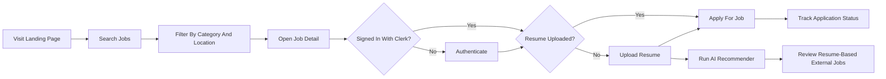
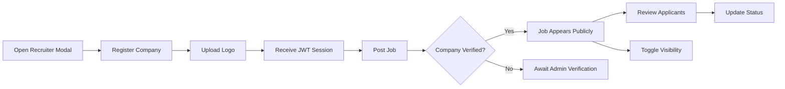
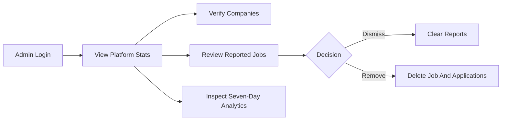
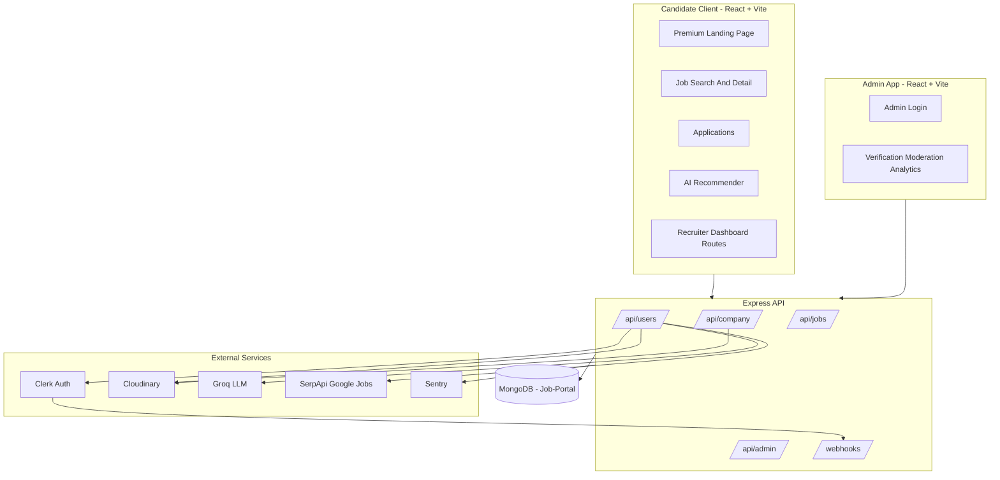
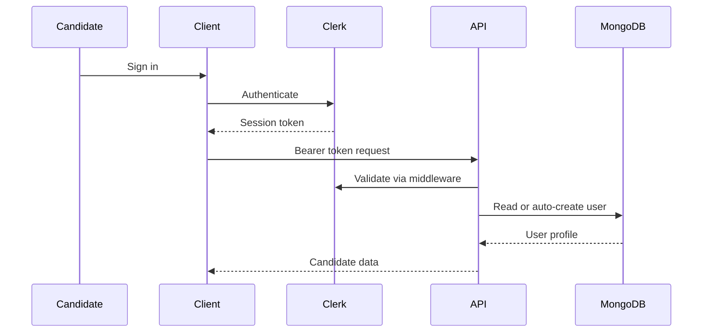
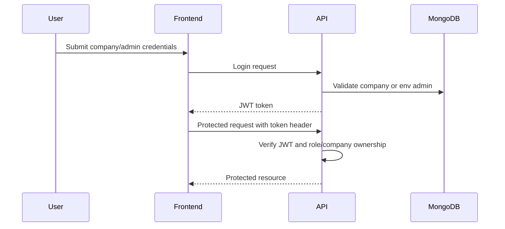
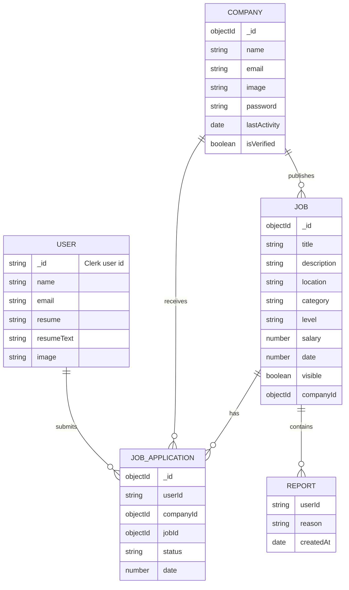
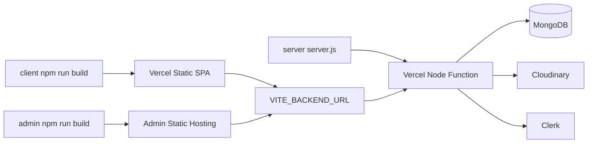

<div align="center">

<!--
  Animated Banner Placeholder
  Recommended: 1600x520 GIF/WebP
  Show: the premium InsiderJobs landing page, job search interaction, AI recommendations,
  recruiter dashboard, and admin moderation in one smooth product walkthrough.
-->


<br />
<br />

<!--
  Project Logo Placeholder
  Recommended: 256x256 PNG/SVG
  Show: a clean InsiderJobs mark suitable for GitHub, favicon, and social cards.
-->


# InsiderJobs

### AI-assisted job discovery, verified recruiter workspaces, and moderation-ready hiring operations in one full-stack MERN platform.

InsiderJobs is a production-minded job marketplace built for candidates, recruiters, and platform administrators. It combines Clerk authentication, resume management, AI-powered job discovery, verified company publishing, application tracking, abuse reporting, admin analytics, and cloud deployment configuration into a polished hiring workflow.

<br />


<br />

[](#)
[](#)
[](#deployment)
[](server/package.json)
[](#license)
[](#contributing)

<br />

[Live Demo](#deployment) | [Product Walkthrough](#product-walkthrough) | [Architecture](#architecture) | [API Reference](#api-reference) | [Setup](#installation)

<!-- Social Link Placeholders: portfolio, LinkedIn, X/Twitter, email, demo video, product deck -->

</div>

---

## Table Of Contents

- [Why This Project Matters](#why-this-project-matters)
- [Product Snapshot](#product-snapshot)
- [Visual Showcase Placeholders](#visual-showcase-placeholders)
- [Feature Showcase](#feature-showcase)
- [Product Walkthrough](#product-walkthrough)
- [Technical Excellence](#technical-excellence)
- [Technology Ecosystem](#technology-ecosystem)
- [Architecture](#architecture)
- [API Reference](#api-reference)
- [Database Schema](#database-schema)
- [Folder Structure](#folder-structure)
- [Installation](#installation)
- [Environment Variables](#environment-variables)
- [Deployment](#deployment)
- [Security](#security)
- [Testing And Quality](#testing-and-quality)
- [Roadmap](#roadmap)
- [Contributing](#contributing)
- [License](#license)

---

## Why This Project Matters

Modern hiring platforms have two competing responsibilities: help candidates find relevant opportunities quickly, and help recruiters operate trusted hiring pipelines without exposing candidates to spam, stale listings, or low-quality employer profiles. InsiderJobs addresses that gap with a three-sided product architecture:

| Audience | Problem Solved | Business Value |
| --- | --- | --- |
| Candidates | Searching across generic listings is noisy, repetitive, and rarely personalized to a resume. | Resume-aware AI recommendations, application tracking, verified company listings, and job reporting improve trust and conversion. |
| Recruiters | Teams need a lightweight workspace to publish jobs, manage applicants, and signal active hiring. | Company accounts, logo branding, job posting, applicant status management, and activity-based listing signals create a practical hiring CRM. |
| Administrators | Public marketplaces need governance to prevent abuse and keep listings credible. | Admin verification, reported job moderation, deletion workflows, and analytics create an operational control plane. |

The result is not just a job board. It is a portfolio-grade hiring system with authentication boundaries, cloud media handling, AI-assisted discovery, moderation workflows, analytics, and deployable frontend/backend surfaces.

---

## Product Snapshot

| Surface | Description | Primary Users |
| --- | --- | --- |
| Candidate Web App | Search jobs, filter listings, inspect roles, upload resumes, apply, track applications, and get AI job recommendations. | Job seekers |
| Recruiter Dashboard | Register with corporate email, manage company profile, post jobs, toggle visibility, review applicants, and update application status. | Hiring teams |
| Admin Console | Authenticate as admin, verify companies, review reported jobs, delete listings, dismiss reports, and monitor platform metrics. | Platform operators |
| API Server | Express 5 API with MongoDB models, Clerk webhook sync, JWT-protected recruiter/admin routes, Cloudinary uploads, PDF parsing, and AI integrations. | Frontend clients |

---

## Visual Showcase Placeholders

Use this section as the media checklist for turning the README into a high-converting portfolio page.

| Visual | Recommended Size | What To Show |
| --- | ---: | --- |
| Hero Product Banner | `1600x520` GIF/WebP | Landing page, search flow, AI recommendations, recruiter dashboard, and admin moderation stitched into one animation. |
| Landing Page Screenshot | `1440x1100` PNG | Smoke-white premium homepage with hero, search, feature sections, testimonials, and app download CTA. |
| Candidate Job Search | `1440x1000` PNG | Search filters, pagination, verified company cards, and hiring activity badges. |
| Job Detail And Apply Flow | `1440x1000` PNG | Job detail page, resume requirement, apply action, and reporting controls. |
| AI Recommendation Demo | `1440x1100` GIF | Resume keyword extraction, editable keyword chips, and external Google Jobs results. |
| Recruiter Dashboard | `1440x1000` PNG | Add job form, rich-text editor, manage jobs, applicant status controls. |
| Admin Console | `1440x1000` PNG | Stats cards, analytics chart, company verification, reported jobs queue. |
| Mobile Candidate Views | `390x1200` PNG | Responsive homepage, listing cards, and applications screen. |
| Architecture Diagram Export | `1800x1200` PNG | High-level system design generated from the Mermaid diagrams below. |
| Demo Recording | `1920x1080` MP4/GIF | End-to-end walkthrough from signup to AI recommendation and admin moderation. |

---

## Feature Showcase

### Candidate Experience

| Feature | What It Does | Why It Matters | Technical Notes |
| --- | --- | --- | --- |
| Job Discovery | Lists verified, visible jobs with title/location search, category filters, location filters, and pagination. | Keeps browsing fast and relevant. | Backend query builder supports regex search, comma-separated filters, pagination, verified company gating, and newest-first sorting. |
| Hiring Activity Signal | Labels jobs as active, slow, or stale based on company activity. | Gives candidates useful freshness context before applying. | Computed from `Company.lastActivity` in job list/detail controllers. |
| Clerk Authentication | Candidate identity is handled through Clerk. | Reduces custom auth risk and enables reliable user sessions. | `@clerk/clerk-react`, `@clerk/express`, `clerkMiddleware`, and Svix webhook verification are implemented. |
| Resume Upload | Candidates upload resumes to Cloudinary. | Makes applications and AI recommendations resume-aware. | Multer handles upload input, Cloudinary stores files, temp files are removed after processing. |
| Resume Text Cache | PDF text is parsed and stored on the user record. | Avoids reparsing the same resume for repeated AI recommendations. | `pdf-parse` extracts text on upload; fallback parsing occurs during AI recommendation if cache is missing. |
| Application Tracking | Candidates can view submitted applications and statuses. | Turns the platform into a personal job search tracker. | Applications populate company and job references from MongoDB. |
| Job Reporting | Users can report suspicious or poor-quality jobs. | Adds marketplace trust and safety. | Reports are appended to `Job.reports` and surfaced in the admin console. |

### AI Job Recommendations

| Capability | Implementation |
| --- | --- |
| Resume-aware keyword extraction | Groq `llama-3.3-70b-versatile` extracts relevant roles and skills from parsed resume text. |
| External job search | SerpApi Google Jobs search is queried for India-focused opportunities. |
| Custom keyword mode | Users can override or refine keywords, bypassing the LLM and searching directly. |
| Deduplication | Results are deduplicated using job IDs or title/company fallback keys. |
| Normalized response shape | External jobs are returned as title, company, location, source, type, salary, posted date, and apply URL. |

> [!NOTE]
> The server imports `apify-client`, but the current AI recommendation implementation uses SerpApi through Axios. This README documents the shipped behavior rather than unused dependency intent.

### Recruiter Workspace

| Feature | What It Does | Engineering Detail |
| --- | --- | --- |
| Company Registration | Recruiters register a company profile with name, corporate email, password, and logo. | Server validates public email domains, hashes passwords with bcrypt, uploads logos to Cloudinary, and returns JWT auth. |
| Recruiter Login | Authenticates company accounts and updates activity timestamp. | JWT generated with `jsonwebtoken`; token stored client-side in local storage. |
| Verification Status | Companies can be verified by admin, and demo workspaces can self-verify through a dedicated endpoint. | Public job search only includes jobs from verified companies. |
| Job Posting | Recruiters create jobs with title, rich description, category, location, level, and salary. | Client uses Quill editor; server persists jobs to MongoDB. |
| Job Visibility Toggle | Recruiters can hide or publish their own listings. | Server checks job ownership before toggling visibility. |
| Applicant Management | Recruiters view applicants and change status to accepted, rejected, or pending. | Applications populate candidate and job details for dashboard display. |
| Applicant Counts | Recruiter job list includes application counts. | Backend uses a MongoDB aggregation to avoid an N+1 query pattern. |

### Admin Operations

| Feature | Purpose | Technical Detail |
| --- | --- | --- |
| Admin Login | Protects the admin console with environment-configured credentials. | JWT includes `role: "admin"` and is validated by admin middleware. |
| Dashboard Stats | Tracks total companies, pending verifications, jobs, and applications. | Count queries aggregate operational state. |
| Company Verification | Approve or revoke company publishing trust. | Company documents store `isVerified`; job listing API filters by verified company IDs. |
| Report Moderation | Review jobs with one or more user reports. | Reported jobs are queried by existence of `reports.0`. |
| Delete Listing | Remove a job and associated applications. | Deletes job document and cascades related `JobApplication` records manually. |
| Analytics Chart | Displays jobs and applications across the last seven days. | Backend computes daily counts, admin UI renders charts with Recharts. |

---

## Product Walkthrough

### Candidate Journey



### Recruiter Journey



### Admin Journey



---

## Technical Excellence

### Architecture Decisions

- **Three-surface frontend architecture:** candidate client, recruiter dashboard routes, and a separate admin application keep operational concerns cleanly separated.
- **API-first backend:** Express route modules isolate candidate, recruiter, admin, job, and webhook workflows.
- **Document database modeling:** MongoDB/Mongoose is used for flexible marketplace entities: users, companies, jobs, and applications.
- **External identity for candidates:** Clerk handles candidate authentication while company/admin workflows use JWT, reflecting different trust models.
- **Cloud media storage:** Cloudinary stores company logos and resumes instead of keeping binary files in the application server.
- **Serverless-aware API export:** the server exports the Express app and only listens locally outside production, matching Vercel serverless deployment expectations.

### Performance And Scalability

| Optimization | Why It Matters |
| --- | --- |
| Paginated job listing API | Prevents large result sets from slowing candidate browsing. |
| Verified company pre-filtering | Keeps public job queries trust-aware before rendering. |
| Applicant count aggregation | Avoids per-job application count queries in recruiter dashboards. |
| Resume text caching | Reduces repeat PDF parsing cost during AI recommendations. |
| Deduplicated external job results | Keeps AI recommendation output cleaner and more useful. |
| SPA rewrites on Vercel | Supports deep links in the React client after deployment. |

### Security And Trust

- Clerk webhook events are verified with Svix signatures before syncing user records.
- Candidate routes rely on Clerk auth middleware and bearer tokens.
- Recruiter passwords are hashed with bcrypt before storage.
- Company and admin routes are protected by JWT middleware.
- Public job discovery excludes unverified company listings.
- Company registration rejects common public email domains on both client and server paths.
- Reported jobs can be moderated or removed by administrators.
- Temporary uploaded files are cleaned after Cloudinary upload/PDF parsing.

> [!IMPORTANT]
> `server/config/instrument.js` currently contains a hardcoded Sentry DSN and enables `sendDefaultPii`. For production hardening, move the DSN to `process.env.SENTRY_DSN` and review PII settings before launch.

---

## Technology Ecosystem

### Frontend


### Backend And Data


### Integrations


---

## Architecture

### System Overview



### Authentication Flow



### Recruiter/Admin JWT Flow



### Database Relationships



### Deployment Shape



---

## Key Achievements And Engineering Highlights

- Built a complete three-sided hiring platform across candidate, recruiter, and admin workflows.
- Implemented hybrid authentication with Clerk for candidates and JWT for recruiter/admin operational surfaces.
- Added verified-company gating so only trusted recruiter listings appear publicly.
- Integrated resume upload, Cloudinary storage, PDF text extraction, and cached resume text for downstream AI workflows.
- Built an AI recommendation pipeline using Groq for resume keyword extraction and SerpApi for external Google Jobs discovery.
- Designed moderation workflows for reported job review, report dismissal, and listing deletion with associated application cleanup.
- Optimized recruiter job management by replacing per-job applicant count queries with a MongoDB aggregation.
- Added Sentry instrumentation with Mongoose integration for observability readiness.
- Designed Vercel-compatible deployment configuration for both SPA routing and serverless Express execution.
- Delivered premium light-theme UI surfaces across landing, candidate, recruiter, and admin experiences.

---

## API Reference

### Public And Candidate Routes

| Method | Endpoint | Auth | Description |
| --- | --- | --- | --- |
| `GET` | `/` | Public | API health response. |
| `GET` | `/api/jobs` | Public | List visible jobs from verified companies with search, filters, and pagination. |
| `GET` | `/api/jobs/:id` | Public | Fetch a single job with company data and hiring activity. |
| `POST` | `/api/jobs/:id/report` | Public payload | Report a job for admin review. |
| `GET` | `/api/users/user` | Clerk | Fetch or auto-create the signed-in candidate profile. |
| `POST` | `/api/users/apply` | Clerk | Apply to a job. |
| `GET` | `/api/users/applications` | Clerk | List candidate applications. |
| `POST` | `/api/users/update-resume` | Clerk + multipart | Upload resume, store in Cloudinary, parse PDF text. |
| `GET` | `/api/users/ai-recommender` | Clerk | Generate resume-aware recommendations; accepts optional `keywords`. |

### Recruiter Routes

| Method | Endpoint | Auth | Description |
| --- | --- | --- | --- |
| `POST` | `/api/company/register` | Public + multipart | Register company, validate corporate email, upload logo, return JWT. |
| `POST` | `/api/company/login` | Public | Authenticate company and return JWT. |
| `GET` | `/api/company/company` | Company JWT | Fetch company profile. |
| `POST` | `/api/company/post-job` | Company JWT | Create a new job listing. |
| `GET` | `/api/company/applicants` | Company JWT | Fetch applications for company jobs. |
| `GET` | `/api/company/list-jobs` | Company JWT | Fetch posted jobs with applicant counts. |
| `POST` | `/api/company/change-status` | Company JWT | Update an application status. |
| `POST` | `/api/company/change-visibility` | Company JWT | Toggle a company-owned job's visibility. |
| `POST` | `/api/company/verify-demo` | Company JWT | Self-verify demo workspace. |

### Admin Routes

| Method | Endpoint | Auth | Description |
| --- | --- | --- | --- |
| `POST` | `/api/admin/login` | Public | Authenticate admin using environment credentials. |
| `GET` | `/api/admin/stats` | Admin JWT | Fetch platform totals. |
| `GET` | `/api/admin/companies` | Admin JWT | List companies without passwords. |
| `POST` | `/api/admin/verify` | Admin JWT | Verify or revoke company status. |
| `GET` | `/api/admin/reported-jobs` | Admin JWT | List jobs with reports. |
| `POST` | `/api/admin/dismiss-report` | Admin JWT | Clear reports from a job. |
| `POST` | `/api/admin/delete-job` | Admin JWT | Delete job and associated applications. |
| `GET` | `/api/admin/analytics` | Admin JWT | Return seven-day jobs/applications analytics. |

### Webhooks And Observability

| Method | Endpoint | Description |
| --- | --- | --- |
| `POST` | `/webhooks` | Clerk user create/update/delete sync verified by Svix headers. |
| `GET` | `/debug-sentry` | Intentionally throws an error to validate Sentry integration. |

---

## Database Schema

| Model | Purpose | Notable Fields |
| --- | --- | --- |
| `User` | Candidate profile synced from Clerk. | `_id` as Clerk ID, unique `email`, `resume`, `resumeText`, `image`. |
| `Company` | Recruiter workspace. | unique `email`, hashed `password`, logo `image`, `lastActivity`, `isVerified`. |
| `Job` | Recruiter-created listing. | `title`, `description`, `location`, `category`, `level`, `salary`, `visible`, `companyId`, `reports`. |
| `JobApplication` | Candidate application to a job. | `userId`, `companyId`, `jobId`, `status`, `date`, unique compound index on `userId + jobId`. |

---

## Folder Structure

```text
InsiderJobs/
|-- admin/                  # Standalone admin React/Vite application
|   |-- src/
|   |   |-- App.jsx         # Admin login, stats, verification, reports, analytics
|   |   `-- index.css
|   `-- package.json
|-- client/                 # Candidate and recruiter React/Vite application
|   |-- src/
|   |   |-- components/     # Landing, job cards, dashboard, recruiter modal, footer
|   |   |-- context/        # Shared app state and API fetch helpers
|   |   |-- pages/          # Home, job detail, applications, AI recommender
|   |   `-- assets/
|   |-- vercel.json         # SPA rewrites
|   `-- package.json
|-- server/                 # Express API server
|   |-- config/             # MongoDB, Cloudinary, Sentry instrumentation
|   |-- controllers/        # Route handlers for users, jobs, companies, admin, AI
|   |-- middlewares/        # Company/admin JWT guards
|   |-- models/             # Mongoose schemas
|   |-- routes/             # Express route modules
|   |-- utils/              # JWT generation
|   |-- server.js           # API entrypoint
|   `-- vercel.json         # Vercel Node deployment config
`-- README.md
```

---

## Installation

### Prerequisites

- Node.js 20+ recommended
- npm
- MongoDB connection string
- Clerk application
- Cloudinary account
- Groq API key
- SerpApi API key
- Optional: Sentry project

### 1. Clone The Repository

```bash
git clone <repository-url>
cd InsiderJobs
```

### 2. Install Dependencies

```bash
cd server
npm install

cd ../client
npm install

cd ../admin
npm install
```

### 3. Configure Environment Variables

Create `.env` files in `server/`, `client/`, and `admin/` using the tables below.

### 4. Run The API

```bash
cd server
npm run server
```

The API runs locally on `http://localhost:5000` unless `PORT` is changed.

### 5. Run The Candidate/Recruiter App

```bash
cd client
npm run dev
```

### 6. Run The Admin App

```bash
cd admin
npm run dev
```

> [!NOTE]
> Docker files are not currently present in the repository. Containerization is a strong future enhancement, but the shipped project is configured for npm-based local development and Vercel-style deployment.

---

## Environment Variables

### `server/.env`

| Variable | Required | Purpose |
| --- | --- | --- |
| `MONGODB_URI` | Yes | MongoDB base URI. The server appends `/Job-Portal`. |
| `JWT_SECRET` | Yes | Signs recruiter and admin JWTs. |
| `CLERK_WEBHOOK_SECRET` | Yes | Verifies Clerk webhook payloads through Svix. |
| `CLOUDINARY_NAME` | Yes | Cloudinary cloud name. |
| `CLOUDINARY_API_KEY` | Yes | Cloudinary API key. |
| `CLOUDINARY_SECRET_KEY` | Yes | Cloudinary API secret. |
| `GROK_API_KEY` | Yes for AI | Groq SDK API key. The current code uses the name `GROK_API_KEY`. |
| `SERP_API_KEY` | Yes for AI | SerpApi key for Google Jobs search. |
| `ADMIN_EMAIL` | Recommended | Admin login email. Defaults to `admin@insiderjobs.com` if omitted. |
| `ADMIN_PASSWORD` | Recommended | Admin login password. Defaults to `admin123` if omitted. |
| `PORT` | No | Local API port. Defaults to `5000`. |
| `NODE_ENV` | No | In production, prevents the server from calling `listen()`. |

### `client/.env`

| Variable | Required | Purpose |
| --- | --- | --- |
| `VITE_BACKEND_URL` | Yes | Base URL for the Express API. |
| `VITE_CLERK_PUBLISHABLE_KEY` | Yes | Clerk publishable key for candidate authentication. |

### `admin/.env`

| Variable | Required | Purpose |
| --- | --- | --- |
| `VITE_BACKEND_URL` | Yes | Base URL for the Express API. |

---

## Deployment

### Client

The client includes `client/vercel.json` with SPA rewrites so nested React Router routes resolve correctly after refresh.

```bash
cd client
npm run build
```

Deploy the `client/` project to Vercel or any static host that supports SPA rewrites.

### Admin

```bash
cd admin
npm run build
```

Deploy the `admin/` project as a separate protected/static frontend or behind an access-controlled URL.

### Server

The server includes `server/vercel.json` configured to route all requests to `server.js` through `@vercel/node`.

```bash
cd server
npm start
```

For Vercel-style production, set all server environment variables in the hosting dashboard and ensure `NODE_ENV=production` so the exported Express app is handled by the serverless runtime.

---

## Security

| Area | Current Implementation | Production Recommendation |
| --- | --- | --- |
| Candidate auth | Clerk middleware and webhook sync. | Configure allowed origins and production Clerk webhook endpoint. |
| Recruiter auth | JWT plus bcrypt password hashing. | Use secure cookie storage or token refresh strategy for production. |
| Admin auth | Environment email/password with JWT. | Replace defaults, add rate limiting, and consider MFA or provider-based admin auth. |
| Uploads | Multer to Cloudinary; temp files cleaned after processing. | Validate MIME types and file sizes explicitly. |
| Job trust | Public jobs require verified companies. | Add audit logs for verification and moderation actions. |
| Monitoring | Sentry initialized with Mongoose integration. | Move DSN to env and review PII collection. |
| Secrets | `.env` files are local. | Never commit real `.env` values; add `.env.example` templates. |

---

## Testing And Quality

### Available Quality Commands

```bash
cd client
npm run lint
npm run build

cd ../admin
npm run lint
npm run build

cd ../server
npm start
```

### Current Test Coverage Status

No dedicated automated test suite was discovered in the repository. The strongest next step is to add:

- API integration tests for auth boundaries, job search, applications, and moderation.
- Component tests for candidate search, recruiter forms, and admin actions.
- End-to-end tests covering candidate apply, recruiter status update, and admin verification.
- CI workflow running lint, build, and API tests on pull requests.

---

## Troubleshooting

| Issue | Likely Cause | Fix |
| --- | --- | --- |
| Client cannot load jobs | `VITE_BACKEND_URL` missing or API offline. | Start the server and confirm the client env points to the API URL. |
| Candidate auth fails | Clerk key or backend middleware mismatch. | Verify `VITE_CLERK_PUBLISHABLE_KEY` and Clerk backend configuration. |
| Webhooks fail | Missing/invalid `CLERK_WEBHOOK_SECRET`. | Copy the webhook signing secret from Clerk and update `server/.env`. |
| AI recommendations fail | Missing `GROK_API_KEY`, `SERP_API_KEY`, or resume text. | Upload a text-based PDF resume and configure both AI/search keys. |
| Resume parsing returns empty text | Resume is image-only or scanned. | Upload a text-based PDF or add OCR support in a future release. |
| Jobs do not appear publicly | Company is not verified or job is hidden. | Verify company in admin or use demo verification, then ensure visibility is on. |
| Admin login insecure defaults | Env values omitted. | Set strong `ADMIN_EMAIL`, `ADMIN_PASSWORD`, and `JWT_SECRET`. |

---

## Roadmap

- Add `.env.example` files for server, client, and admin.
- Move Sentry DSN and monitoring options fully into environment configuration.
- Add automated test coverage and CI.
- Add rate limiting and request validation for auth, reports, and uploads.
- Add recruiter email verification and invite-based team accounts.
- Add OCR fallback for scanned resumes.
- Add saved jobs, candidate profile enrichment, and recommendation feedback loops.
- Add audit logs for admin verification, moderation, and deletion actions.
- Add Docker and Docker Compose for local full-stack orchestration.
- Add production analytics, uptime monitoring, and structured API logging.

---

## Contributing

Contributions are welcome. A strong contribution should:

1. Keep candidate, recruiter, and admin concerns clearly separated.
2. Preserve verified-company gating for public job discovery.
3. Include thoughtful error handling for external services.
4. Avoid committing secrets, generated build output, or local environment files.
5. Add or update documentation when changing workflows, APIs, or environment variables.

Suggested workflow:

```bash
git checkout -b feature/your-feature
npm install
npm run build
git commit -m "feat: describe your change"
```

---

## Acknowledgments

InsiderJobs is powered by the open-source JavaScript ecosystem and integrations including React, Vite, Express, MongoDB, Clerk, Cloudinary, Groq, SerpApi, Sentry, and Vercel.

---

## License

The server package declares the project license as `ISC`. Add a root `LICENSE` file before publishing the repository as a public open-source project.

---

<div align="center">

### InsiderJobs

Built as a full-stack, AI-assisted hiring platform for candidates, recruiters, and platform operators.

**Portfolio:** `<add-portfolio-url>` | **LinkedIn:** `<add-linkedin-url>` | **Email:** `<add-email>` | **Demo:** `<add-live-demo-url>`

</div>
