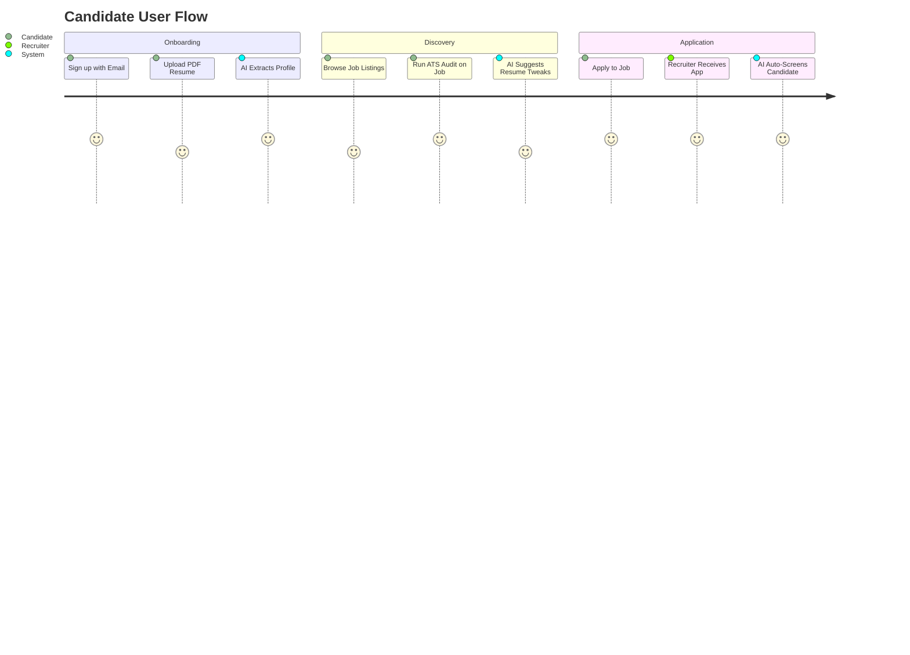
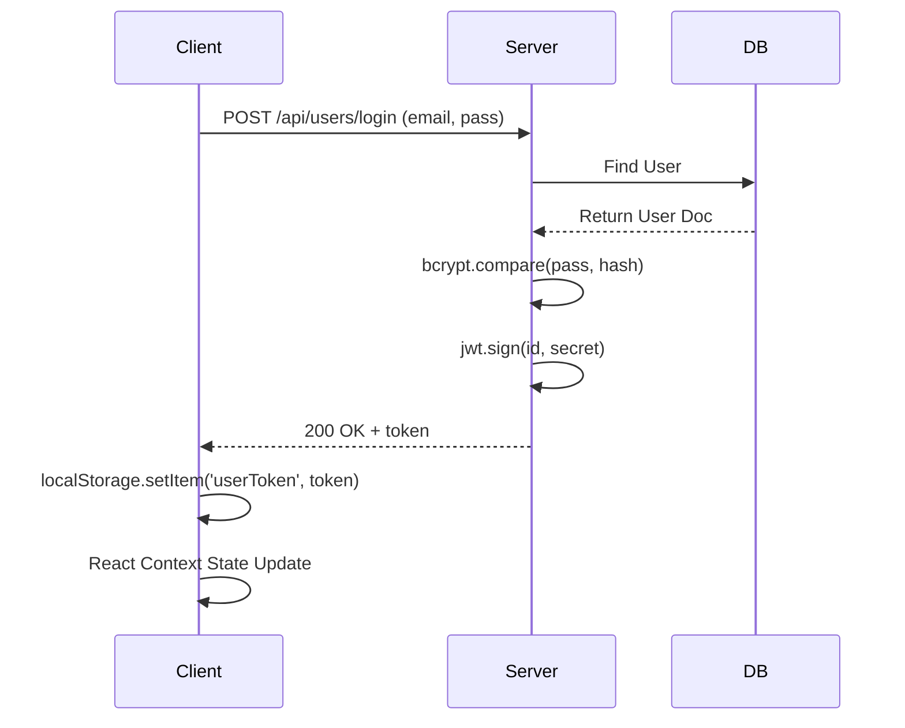
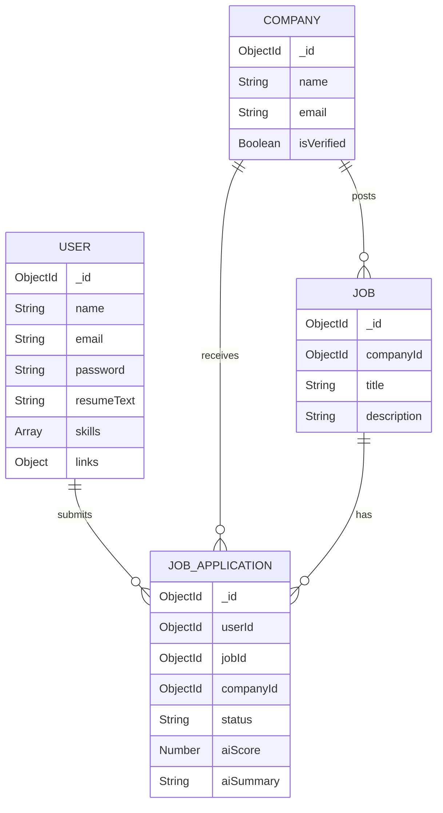

<div align="center">
  <!-- BANNER PLACEHOLDER -->
  

  <br />
  <br />

  <!-- LOGO PLACEHOLDER -->
  

  <h1 align="center">InsiderJobs</h1>
  <p align="center"><strong>Next-Generation AI-Powered Recruitment & Career Command Center</strong></p>

  <p align="center">
    A premium Applicant Tracking System (ATS) and Job Board built with React, Node.js, and Groq LLMs. Bridging the gap between top talent and leading companies through intelligent AI matching, automated resume parsing, and seamless hiring pipelines.
  </p>

  <!-- BADGES -->
  <p align="center">
    
    
    
    
    
  </p>

  <p align="center">
    <!-- STATS PLACEHOLDERS -->
    
    
    
    
    
  </p>
  
  <p align="center">
    <!-- SOCIAL LINKS PLACEHOLDERS -->
    <a href="[Live Demo URL]"></a>
    <a href="[LinkedIn URL]"></a>
    <a href="[Portfolio URL]"></a>
  </p>
</div>

---

## ⚡ Key Achievements & Engineering Highlights

For Technical Recruiters and Engineering Managers reviewing this project, here are the most significant technical achievements:

> [!TIP]
> **Why this project stands out:** This is not a standard CRUD application. It incorporates complex AI orchestration, real-time data handling, and robust multi-tenant architectures.

- **Intelligent AI Orchestration (Groq API + LLaMA 3 70B):** Implemented a high-performance backend pipeline that parses raw PDF resumes via `unpdf`, extracts structured text, and feeds it to Groq LLMs. The AI automatically generates an ATS match score, extracts skills/experience/education, outputs tailored interview questions for recruiters, and provides personalized resume tailoring suggestions.
- **Multi-Tenant Architecture & Role-Based Access Control (RBAC):** Custom JWT-based authentication system securely isolating three distinct domains: Candidates, Recruiters (Companies), and Admins. Includes company verification workflows.
- **Real-Time Polling & Optimistic UI Updates:** Built highly responsive recruiter dashboards that auto-refresh every 30 seconds to fetch new applicants without memory leaks, paired with optimistic state updates for instant AI screening results.
- **Enterprise-Grade UI/UX:** Designed a completely custom, Tailwind-based design system featuring glassmorphism, fluid micro-animations, conic-gradient data visualizations, and robust responsive layouts. No pre-built component libraries (like MUI/Chakra) were relied upon for core layouts.
- **Complex Aggregation & Analytics:** Frontend analytics engine that calculates funnel conversion rates, time-to-decision metrics, and identifies "stale" applications on the fly.

---

## 🚀 Feature Showcase

### 🧠 AI-Powered Candidate Features
| Feature | Description | Technical Implementation |
|---------|-------------|--------------------------|
| **Smart PDF Resume Parsing** | Upload a PDF resume and watch the AI instantly extract your skills, education, and experience into a structured profile. | `unpdf` buffer parsing → Groq LLM JSON schema enforcement. |
| **ATS Job Audit** | Compares candidate's resume text against job descriptions to provide a match score, missing keywords, and tailoring tips. | Server-side prompt engineering with LLaMA 3 returning strictly typed JSON. |
| **AI Job Recommender** | Suggests the best active job listings based on the semantic match of the candidate's parsed profile. | Dynamic querying and filtering algorithms based on AI-extracted tags. |
| **Career Command Center** | A visual pipeline showing pending, accepted, and rejected applications with success rate visualizations. | Custom SVG Conic Gradients, local data aggregation, and memoized math. |

### 🏢 Enterprise Recruiter Console
| Feature | Description | Technical Implementation |
|---------|-------------|--------------------------|
| **AI Candidate Pre-Screening** | Recruiters can click a button to have the AI instantly summarize an applicant's fit, score them (0-100), and generate 3 custom interview questions. | Asynchronous `Groq SDK` API calls with MongoDB document updates. |
| **Pipeline Management** | Track applicants through a visual table, mark them as Accepted/Rejected, and manage active/hidden job postings. | React state management with auto-refresh (`setInterval`) hooks and Axios interceptors. |
| **Rich Text Job Editor** | Create compelling job descriptions using a fully integrated rich text editor. | Integrated `Quill.js` mapped to MongoDB string schemas. |
| **Workspace Verification** | Companies cannot post active jobs until their workspace email is verified and approved by the platform Admin. | Secure backend flags (`isEmailVerified`, `isVerified`) checked via middleware. |

<br />

<div align="center">
  <!-- DASHBOARD PREVIEW PLACEHOLDER -->
  
  <p><em>Recruiter Pipeline Dashboard showing Candidate Social Links, Resumes, and Application Statuses</em></p>
</div>

---

## 🗺️ Interactive Product Walkthrough

### The User Journey



### Authentication Flow


---

## 🛠️ Technology Ecosystem

### Frontend


### Backend & Database


### AI & Cloud Integrations


---

## 🏗️ Architecture & Database Design

### System Design
The application follows a decoupled Client-Server architecture. The React/Vite frontend communicates securely with the Express.js REST API. Static assets and resumes are streamed directly to Cloudinary.

### Database Relational Schema



---

## 💻 Installation & Local Development

### Prerequisites
- Node.js (v18+ recommended)
- MongoDB Cluster (Local or Atlas)
- Groq API Key (for AI features)
- Cloudinary Account (for file storage)

### Step 1: Clone the repository
```bash
git clone https://github.com/SarthakDudhe/InsiderJobs.git
cd InsiderJobs
```

### Step 2: Setup Backend
```bash
cd server
npm install
```
Create a `.env` file in the `server` directory:
```env
MONGODB_URI=your_mongodb_connection_string
GROK_API_KEY=your_groq_api_key
CLOUDINARY_API_KEY=your_cloudinary_api_key
CLOUDINARY_SECRET_KEY=your_cloudinary_secret
CLOUDINARY_NAME=your_cloudinary_name
JWT_SECRET=your_super_secret_key
PORT=5000
```
Start the backend server:
```bash
npm run dev
```

### Step 3: Setup Frontend (Client)
```bash
cd ../client
npm install
```
Create a `.env` file in the `client` directory:
```env
VITE_BACKEND_URL=http://localhost:5000
```
Start the Vite development server:
```bash
npm run dev
```

### Step 4: Setup Admin Dashboard
```bash
cd ../admin
npm install
npm run dev
```

---

## 🔒 Security Considerations

- **Authentication:** Custom JWT-based stateless authentication with secure storage and strict expiration limits. Frontend robustly clears local storage if malformed/expired tokens are detected.
- **File Uploads:** Validated via `multer` before uploading to Cloudinary. Temporary local files are immediately unlinked (deleted) from the server filesystem via `fs.unlink` to prevent directory traversal and storage exhaustion.
- **Passwords:** Hashed with a 10-round salt using `bcryptjs` before persisting to MongoDB.
- **API Guarding:** Dedicated Middlewares (`protectUser`, `protectCompany`, `protectAdmin`) enforce role-based access control.

---

<div align="center">
  <h2>Ready to revolutionize recruitment?</h2>
  <p>Contributions, issues, and feature requests are welcome!</p>
  <p>Feel free to check <a href="#">issues page</a>.</p>
  
  <br />
  
</div>

<p align="center">Made with ❤️ by <a href="https://github.com/SarthakDudhe">Sarthak Dudhe</a></p>
