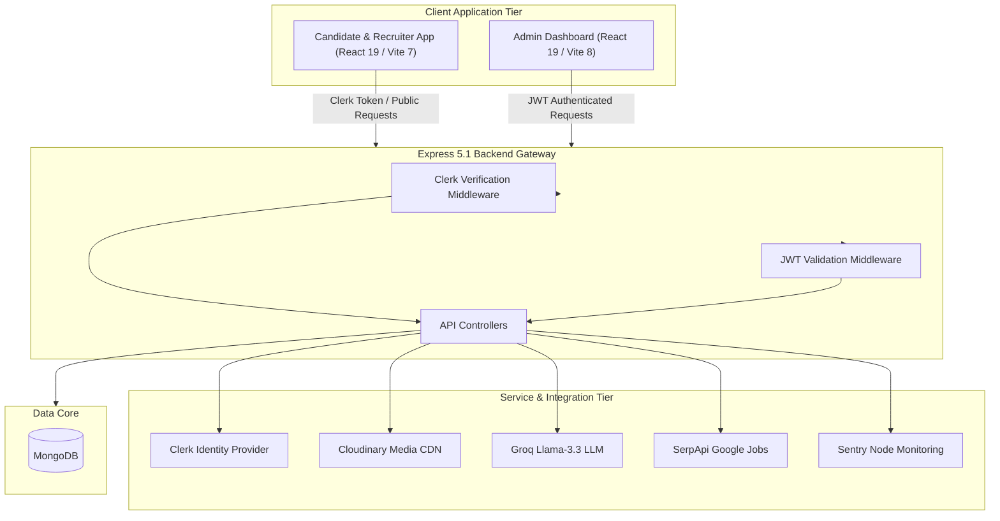
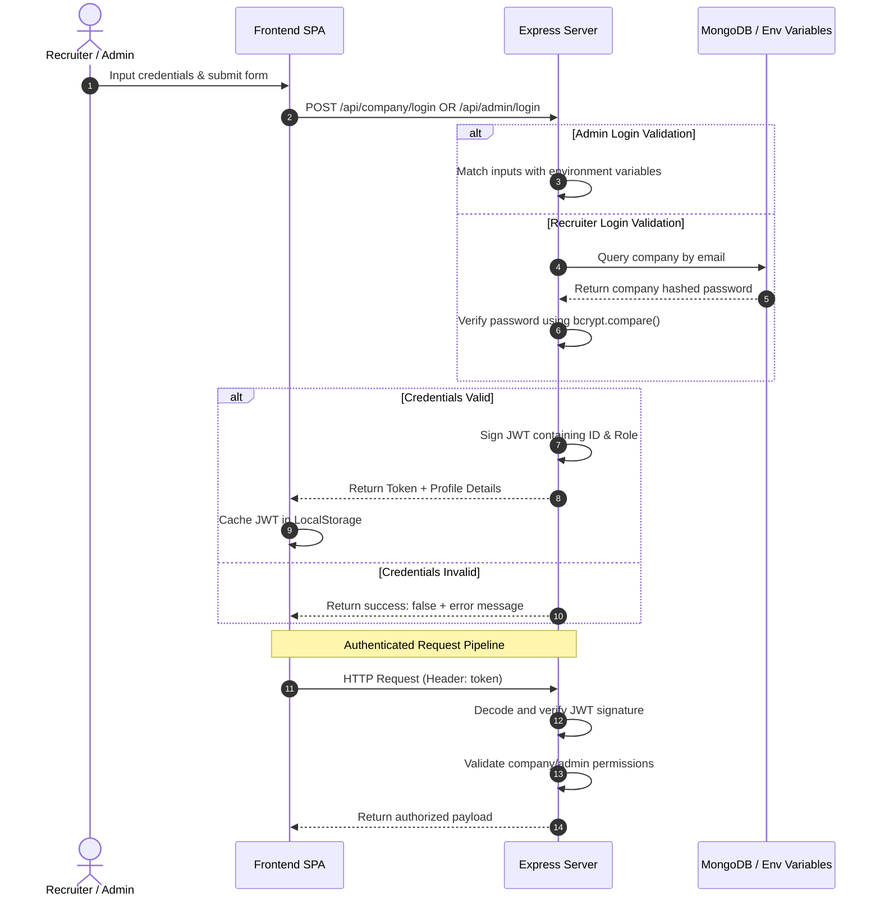
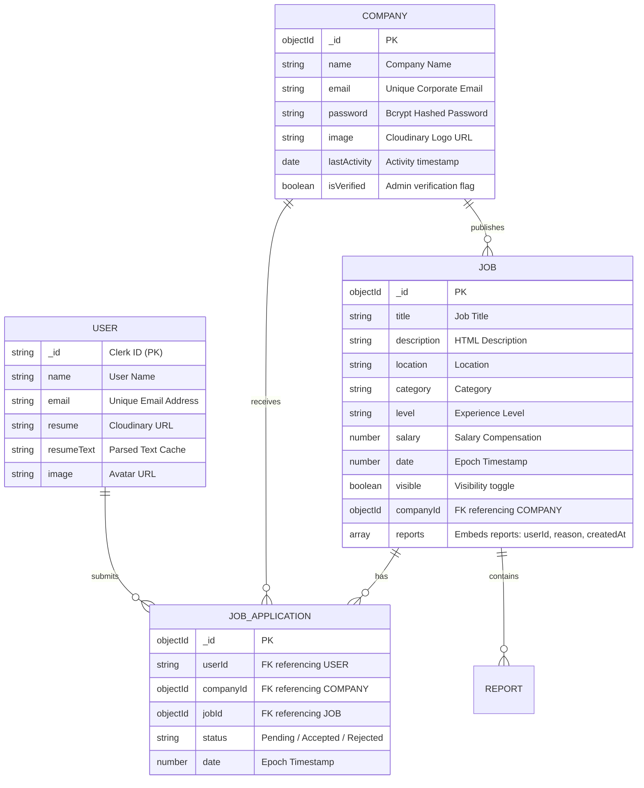

<div align="center">

<!-- Hero Animated Banner -->


<br />
<br />

<!-- Project Logo -->


# InsiderJobs

### A Production-Grade Multi-Tenant Job Marketplace featuring AI-Assisted Recommendation Pipelines, Verified Recruiter Workspaces, and Standalone Admin Operations.

InsiderJobs is a multi-tenant hiring platform built on React 19, Vite, Express 5, and MongoDB. It integrates Clerk identity verification for candidates, corporate email validations, custom JWT sessions for recruiters, automatic resume PDF extraction, Groq AI keyword recommendation, reported job moderation, and interactive Recharts administration panels.

<br />

[](#)
[](#license)
[](file:///c:/Users/saksh/Desktop/MY%20PROJECTS/InsiderJobs/server/package.json)

<br />

[Product Gallery](#-visual-product-gallery) • [Why This Project Matters](#-why-this-project-matters) • [Features](#-discovered-features--workflows) • [Architecture](#-system-architecture--communication-flow) • [Tech Stack](#-technology-ecosystem) • [Setup Guide](#-local-installation--developer-guide)

</div>

---

## 📽️ Visual Product Gallery

Below is the visual specs reference mapping key product screens, target aspect ratios, and mock rendering contexts designed for recruiters and engineering leads.

| Product Surface | Target Aspect Ratio | Recommended Resolution | Mock Context & Expected Visual |
| :--- | :---: | :---: | :--- |
| **Candidate Landing Page** | `16:10` | `1440x900` | Homepage showing modern light theme, hero section with search bars, category selectors, and active hiring badges. |
| **AI Recommendation Console** | `16:10` | `1440x900` | Split-pane showing the resume PDF upload portal alongside Groq-extracted skills chips and matching external Google Jobs. |
| **Recruiter Dashboard Workspace** | `16:10` | `1440x900` | Employer interface showing the posted jobs table, applicant counts, status update drop-downs, and visibility toggle switches. |
| **Admin Operations Dashboard** | `16:10` | `1440x900` | Administrator console rendering the 7-day AreaChart (Recharts), pending company verification queue, and reported job flags table. |

---

## 🎯 Why This Project Matters

Online hiring marketplaces suffer from a major trust and verification gap. Platforms are frequently flooded with spam listings, outdated entries ("Ghost Jobs"), and unverified companies, while candidates must navigate manual keyword searches that do not align with their resumes.

InsiderJobs addresses these real-world operational challenges by providing:

* **Spam & Ghost Job Prevention:** Implements admin-moderated company verification gates, ensuring only trusted corporate entities can publish jobs to the public index.
* **Resume-to-Job Matching Automation:** Resolves search fatigue by parsing uploaded candidate resumes, caching extracted text, and utilizing LLMs to query external networks for matching roles.
* **Streamlined Candidate Pipeline Management:** Provides B2B employers with custom email validation registration, Quill rich-text editors for job posting, and single-query applicant tracking to reduce backend overhead.

---

## ✨ Discovered Features & Workflows

### 1. Candidate Application & Commerce
- **Verified Job Discovery:** Supports title and location regex matching, checkbox filters, and pagination, excluding listings from unverified employers.
- **Hiring Freshness Indicators:** Computes hiring activity levels (`Active`, `Slow`, `Stale`) dynamically by checking employer login frequency.
- **Application Portal:** Prevents duplicate submissions using Mongoose compound unique indexes on applicant and job identifiers.

### 2. Groq AI Recommender Pipeline
- **Resume Text Caching:** Automatically reads PDF uploads using `pdf-parse` and caches the extracted text, preventing duplicate parsing overhead.
- **LLM Extraction:** Sends cached text to Groq API (`llama-3.3-70b-versatile`) under structured JSON formatting constraints to isolate core roles and skills.
- **SerpApi Integration:** Queries Google Jobs (targeted to India) using extracted tags, returning structured external opportunities with candidate override options.

### 3. Recruiter Dashboard Workspace
- **Domain Verification Gate:** Screens company registrations by comparing domains against public providers, blocking common emails (e.g. Gmail, Yahoo).
- **Listing Visibility Toggle:** Allows recruiters to hide or publish active postings, keeping the candidate discovery feed up to date.
- **Single-Query Aggregation:** Mitigates the N+1 database query problem by summarizing applicant counts using a single MongoDB aggregation pipeline.

### 4. Admin Operations Console
- **Reported Jobs Queue:** Consolidates reported jobs containing candidate flags into a single moderation queue for review.
- **One-Click Moderation Actions:** Allows administrators to clear reported flags or delete the job, cascading deletions to clean up associated applications.
- **Recharts Data Visualization:** Renders daily metrics for jobs posted and applications submitted over the last 7 days.

---

## 🛠️ Technology Ecosystem

### Frontend Client Tier
* **Core Framework:** React 19.1 & Vite 7 (Candidate & Recruiter SPA)
* **Admin Dashboard:** React 19.2 & Vite 8 SPA
* **Styling & Layout:** Tailwind CSS v4, Styled-Components, Lucide React
* **Integrations:** Axios, React Router 7, Quill Editor, Recharts, React Toastify

### Backend API Tier
* **Core Engine:** Node.js (ES Modules), Express 5.1
* **Database Client:** MongoDB & Mongoose 8
* **Authentication Services:** JSON Web Tokens (JWT), bcrypt (B2B Hashing)
* **File Parser Engine:** Multer, `pdf-parse`

### Integration Services
* **Identity Management:** `@clerk/clerk-react`, `@clerk/express` (Candidate Authentication)
* **Webhook Security:** Svix (Clerk event verification)
* **Media Storage CDN:** Cloudinary (Resume & Logo storage)
* **AI & Search Engines:** Groq SDK (Llama-3.3 LLM), SerpApi (Google Jobs API)
* **Observability:** Sentry Node SDK (with Mongoose integration)

---

## 📐 System Architecture & Communication Flow

### High-Level System Architecture



### Recruiter & Admin JWT Authentication Flow



---

## ⚡ Technical Excellence & Engineering Highlights

* **Three-Surface Monorepo Topography:** Manages candidate profiles, recruiter interfaces, and admin moderation consoles inside a single repository structure, maintaining clean separation of concerns.
* **Hybrid Session Hydration:** Decouples authentication contexts using Clerk OAuth to manage consumer candidates, and custom JWT tokens to authenticate recruiter and admin operations.
* **N+1 Database Query Mitigation:** Replaces nested loops with MongoDB aggregation pipelines to calculate candidate application counts in a single query.
- **Resume Cache Hydration:** Persists parsed PDF text to Mongoose user records, preventing redundant PDF parsing operations during AI recommendation queries.
- **Print stylesheet overrides:** Restructures CSS rendering paths to ensure candidate resume sheets print cleanly from the web browser.
- **Custom Recharts Coordinate Mapping:** Integrates custom coordinate tooltips inside Recharts dashboards, mapping data dimensions across the last 7 days of platform activity.

---

## 📊 Database Schema



---

## 📁 Monorepo Directory Layout

```text
InsiderJobs/
├── admin/                           # Standalone Admin Operations UI (Vite 8)
│   ├── src/
│   │   ├── App.css                  # Custom styling for admin dashboards
│   │   ├── App.jsx                  # Single Page Admin Control Console
│   │   ├── index.css                # Base CSS directives with Tailwind v4
│   │   └── main.jsx                 # Vite mounting module
│   └── package.json                 # Admin dependencies (Recharts, etc.)
├── client/                          # Candidate & Recruiter Interface UI (Vite 7)
│   ├── src/
│   │   ├── context/
│   │   │   └── AppContext.jsx       # State management and API fetch wrapper
│   │   ├── Pages/                   # Route view pages
│   │   │   ├── AddJob.jsx           # Job posting editor
│   │   │   ├── AIJobRecommender.jsx # Resume upload & recommendations
│   │   │   ├── Application.jsx      # Candidate tracking dashboard
│   │   │   ├── ApplyJob.jsx         # Job details and reporting modal
│   │   │   ├── Dashboard.jsx        # Recruiter workflow console layout
│   │   │   ├── Home.jsx             # Candidate landing page
│   │   │   ├── ManageJobs.jsx       # Recruiter active listings console
│   │   │   └── ViewApplications.jsx # Recruiter applicant review console
│   │   ├── App.jsx                  # Main router definitions
│   │   └── main.jsx                 # Vite mounting entrypoint
│   └── package.json                 # Candidate package configurations
└── server/                          # Consolidated Express API Backend
    ├── config/
    │   ├── db.js                    # MongoDB mongoose database client
    │   ├── cloudinary.js            # Cloudinary API storage config
    │   ├── instrument.js            # Sentry Node monitoring initialization
    │   └── multer.js                # Disk upload destination configuration
    ├── controllers/
    │   ├── adminController.js       # Admin actions
    │   ├── aiController.js          # AI and SerpApi logic
    │   ├── companyController.js     # Recruiter actions
    │   ├── jobController.js         # Public queries & reporting
    │   └── userController.js        # Profile and resume actions
    ├── middlewares/
    │   └── companyAuth.js           # JWT validation middleware
    ├── models/
    │   ├── Company.js               # Mongoose company model
    │   ├── Job.js                   # Mongoose job model
    │   ├── JobApplication.js        # Mongoose application model
    │   └── User.js                  # Mongoose user model
    ├── server.js                    # Core server setup & middleware
    └── package.json                 # Node package configurations
```

---

## Key Configurations & Local Installation

### 🗝️ Environment Configuration

Create a `.env` file in the `server/` directory and configure the following variables:

```ini
# Server Setup
PORT=5000
NODE_ENV=development

# Database Configuration
MONGODB_URI=mongodb+srv://<username>:<password>@cluster.mongodb.net

# JWT Signature Secret
JWT_SECRET=your_jwt_signing_secret_here

# Clerk Authentication Webhooks
CLERK_WEBHOOK_SECRET=whsec_your_clerk_svix_secret_here

# Cloudinary Integration
CLOUDINARY_NAME=your_cloudinary_name
CLOUDINARY_API_KEY=your_cloudinary_key
CLOUDINARY_SECRET_KEY=your_cloudinary_secret

# AI Recommendation Integration
GROK_API_KEY=gsk_your_groq_api_key_here
SERP_API_KEY=your_serp_api_key_here

# Default Admin Credentials
ADMIN_EMAIL=admin@insiderjobs.com
ADMIN_PASSWORD=admin123
```

Ensure the `client/.env` and `admin/.env` files point to the backend URL:
```ini
VITE_BACKEND_URL=http://localhost:5000
VITE_CLERK_PUBLISHABLE_KEY=pk_test_your_clerk_key_here # (client only)
```

---

### 🚀 Local Installation & Developer Guide

#### 1. Install Dependencies
Run the installation commands in each directory:
```bash
# Server dependencies
cd server
npm install

# Client dependencies
cd ../client
npm install

# Admin dependencies
cd ../admin
npm install
```

#### 2. Run the Local Development Servers
Run the services in separate terminal windows:
```bash
# Run backend API server (runs on port 5000)
cd server
npm run server

# Run candidate/recruiter frontend (runs on port 5173)
cd client
npm run dev

# Run admin dashboard console (runs on port 5174)
cd admin
npm run dev
```

#### 3. Compile Production Builds
Ensure all builds compile cleanly before deployment:
```bash
cd client && npm run build
cd ../admin && npm run build
```

---

## 🔒 Security Architectures

InsiderJobs implements several layers of security to protect data and verify identities:

- **Bcrypt Password Encryption:** Recruiter registration hashes passwords using `bcrypt` with a work salt factor of `10` before persisting details.
- **JWT Endpoint Authentication:** Restricts recruiter and admin endpoints by verifying custom JSON Web Tokens passed in request headers.
- **Clerk Signature Verification:** Uses Svix signature verification to validate incoming Clerk user webhooks, preventing payload spoofing.
- **Corporate Domain Enforcement:** Screens company registrations by comparing domains against public providers, blocking common email domains (e.g. Gmail, Yahoo).
- **Temporary Upload Cleanup:** Automatically deletes temporary file writes from the local disk using file system unlink calls after processing is complete.

---

## 🤝 Contributing Guidelines & License

### Contributing Guidelines
1. **Maintain separation of concerns:** Ensure changes in `client/`, `admin/`, and `server/` remain decoupled.
2. **Preserve verification checks:** Do not bypass company verification checks on the public job listing endpoints.
3. **Keep Commits Clean:** Do not commit environment configuration files (`.env`) or build output folders.

### Recommended Git Workflow
```bash
git checkout -b feature/your-feature-name
npm run build --prefix client
git commit -m "feat: add feature details"
git push origin feature/your-feature-name
```

### License
This project is licensed under the **MIT License**. Refer to the server's [package.json](file:///c:/Users/saksh/Desktop/MY%20PROJECTS/InsiderJobs/server/package.json#L12) file for license details.

---

## 📧 Contact & Developer Info

* **Developer Portfolio:** [Your Website](https://your-portfolio-url.com)
* **GitHub Repository:** [Your GitHub Profile](https://github.com/your-username)
* **LinkedIn Profile:** [Your LinkedIn](https://linkedin.com/in/your-username)
* **Corporate Email:** contact@insiderjobs.com
